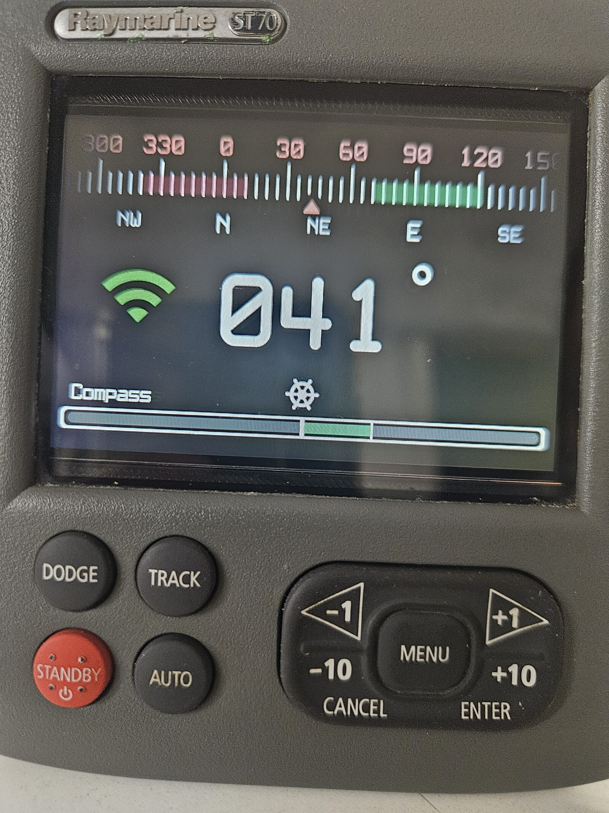

  

# Pypilot Remote

## Overview

**Pypilot Remote** is a Wi-Fi remote control and display for the  
[pypilot](https://github.com/pypilot/pypilot) open-source marine autopilot by Sean D’Epagnier.

It connects to a pypilot server in client mode and provides a **clean, dedicated hardware interface**
to control the autopilot and display essential navigation and system information.

The project is currently housed in a **Raymarine ST70 autopilot display**, giving new life to legacy
marine hardware. The design is intentionally adaptable so it can be reused with other discontinued
or surplus commercial enclosures.

A future goal is a **custom 3D-printed enclosure**, which would make the project more accessible
without relying on expensive legacy hardware. This will require additional work around waterproof
screen mounting, buttons, and connectors.

  

---

## Hardware

- **MCU:** ESP32-S3 N16R8 with external antenna  
- **Display:** 3.47" transflective color LCD  
  - Resolution: 480×320  
  - Model: UEED035HV-RX40-L001B (Viewe)  
- **Input:** 9 physical pushbuttons (no touchscreen)
- **Power input:** 10–18 V DC
- **Programming:**  
  - USB (without opening the enclosure)  
  - OTA (Over-The-Air updates)

---

## Software & Design Tools

- **Firmware:** ESP32 (Arduino framework)
- **IDE:** Eclipse Sloeber
- **Hardware design:** KiCad v9
- **License:** GPL-3.0-only

---

## Features

- Connects to a pypilot server or creates an AP for configuration
- Autopilot **Auto / Standby** control
- Steering mode selection
- Course changes in Auto mode:
  - −1°, −10°, +1°, +10°
- Adjustable backlight for screen and buttons
- Light and dark UI themes
- Information screens:
  - Pypilot data
  - Device status
- Scrollable console log
- “Return to previous heading” Auto command
- Persistent configuration stored in EEPROM
- Robust Wi-Fi and TCP reconnection handling
- Visual Wi-Fi status indicator

---

## License

This project is licensed under the  
**GNU General Public License v3.0 (GPL-3.0-only)**.

See the `LICENSE` file for details.
