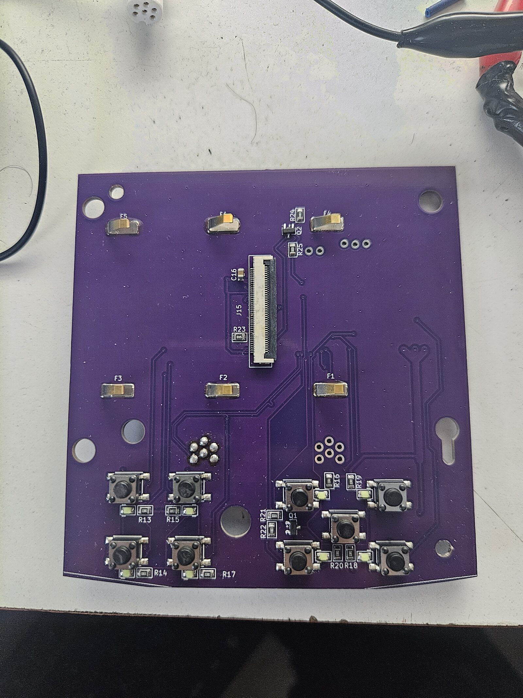
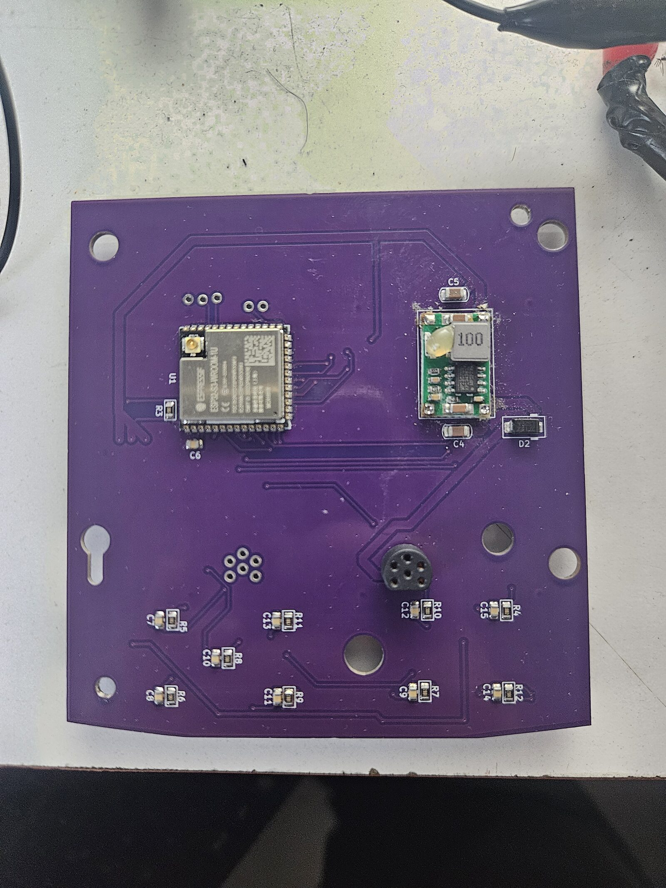
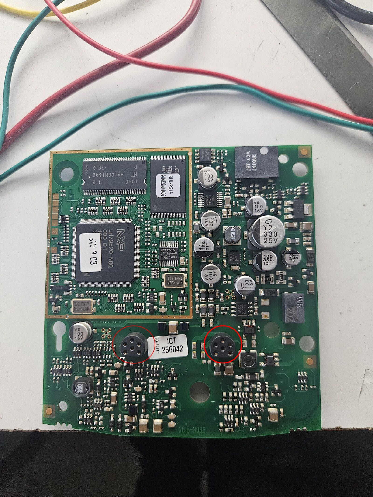

# PCB / Hardware Design

This directory contains the **PCB design files** for the **Pypilot Remote** hardware.

The board is designed using **KiCad v9** and is intended to be manufactured using standard PCB
fabrication and assembly services.

---

## Design Tools

- **EDA software:** KiCad v9  
- **Project files:** Native KiCad schematic and PCB files  
- **Units:** Metric

---

## Manufacturing

### PCB Fabrication
- The PCB was ordered and manufactured using **JLCPCB**

### Component Sourcing
- All electronic components were sourced from **LCSC**
- Component details and ordering information are provided in:

```
LCSCpartNum.csv
```

This file contains LCSC part numbers and additional information useful for ordering parts.

<p align="center">
  
</p>

<p align="center">
  
</p>

---

## Assembly Notes

### SeatalkNG Connector

The SeatalkNG connector is **not a standard off-the-shelf part**.

To populate it:
- Desolder one of the two SeatalkNG connectors from a **stock Raymarine ST70 PCB**
- Solder the recovered connector onto the **Pypilot Remote PCB**

This approach was chosen to ensure mechanical compatibility with the original enclosure.

<p align="center">
  
</p>

---

### 3D Printed Parts

A **3D-printed adapter for the LCD screen** is required.

- The adapter files are located in the `3dparts/` directory
- It is used to correctly position and secure the display within the enclosure

---

### Double-Sided Assembly

- The PCB uses **components on both top and bottom layers**
- This may be more challenging for home assembly, but it is feasible

---

## Notes

- The PCB design is closely tied to the enclosure and mechanical layout
- Modifications may be required if adapting the design to a different housing

---

## License

The PCB design is released under the  
**GNU General Public License v3.0 (GPL-3.0-only)**.

See the `LICENSE` file in the root of the repository for details.
